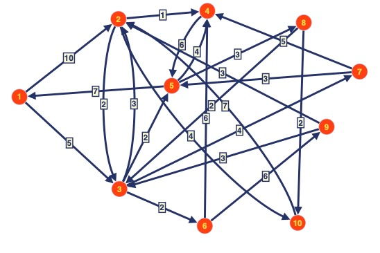

{
  "TotalNodes": 10,
  "DistanceMatrix": [

    [0, 8, 5, 9, 7, 7, 9, 10, 13, 12],
    [11, 0, 2, 1, 4, 4, 6, 7, 10, 4],
    [9, 3, 0, 4, 2, 2, 4, 5, 8, 7],
    [13, 14, 11, 0, 6, 13, 15, 9, 19, 11],
    [7, 8, 5, 4, 0, 7, 9, 3, 13, 5],
    [18, 9, 9, 6, 11, 0, 13, 14, 6, 13],
    [10, 11, 8, 5, 3, 10, 0, 6, 16, 8],
    [11, 5, 2, 6, 4, 4, 6, 0, 10, 2],
    [12, 3, 3, 4, 5, 5, 7, 8, 0, 7],
    [18, 7, 9, 8, 11, 11, 13, 14, 17, 0]
  ]
}

Implementación de Algoritmo Genético y Optimización para Rutas Geoespaciales.
En este repositorio, se presentan dos implementaciones para resolver el Problema de optimización para rutas geoespaciales, utilizando algoritmos genéticos y técnicas de optimización. A continuación, se proporciona una guía técnica que describe en detalle cada implementación, su ejecución y las decisiones de diseño tomadas.
Implementación de Algoritmo Genético (main.py)
1.1 Descripción Técnica
El archivo main.py contiene una implementación de un algoritmo genético para resolver la optimización para rutas geoespaciales. El algoritmo utiliza la biblioteca DEAP (Distributed Evolutionary Algorithms in Python) para realizar la evolución de las soluciones.
1.2 Estructura del Código
1.2.1 Creación de Individuos y Población
Se utilizan objetos creados con DEAP para definir los individuos y su aptitud (fitness).
Los individuos representan una permutación de ciudades. 
Se crea una población inicial de individuos aleatorios.
1.2.2 Función Objetivo (Fitness)
La función evalTSP calcula la distancia total recorrida por el viajero.
La distancia se calcula sumando las distancias entre cada par de ciudades en la permutación.
El objetivo es minimizar esta distancia.
1.2.3 Operadores Genéticos
Se utilizan operadores genéticos estándar como el cruzamiento (crossover) y la mutación.
El cruzamiento se realiza mediante el operador "Ordered Crossover" (tools.cxOrdered).
La mutación consiste en reorganizar las ciudades en una permutación (tools.mutShuffleIndexes).
1.2.4 Parámetros y Configuración
Se definen parámetros como la probabilidad de cruzamiento (CXPB), la probabilidad de mutación (MUTPB), y el número de generaciones (NGEN).
Se crea una población inicial y se utiliza el algoritmo eaMuPlusLambda para evolucionar la población.
1.3 Ejecución del Código
1.3.1 Requisitos
Python 3.
Biblioteca DEAP instalada (pip install deap).
1.3.2 Ejecución
Clonar el repositorio o descargar los archivos main.py y data.json en su sistema.
Asegurar  que el archivo data.json contenga la matriz de distancias adecuada para el problema. Puede modificar este archivo según sus necesidades.
Abra una terminal en el directorio donde se encuentran los archivos main.py y data.json.
Ejecute el siguiente comando para iniciar el algoritmo genético:

python main.py

El algoritmo genético se ejecutará y mostrará información sobre cada generación, incluida la distancia del mejor recorrido encontrado hasta el momento. Al final de la ejecución, se mostrará el mejor recorrido encontrado y su distancia total.
2. Configuración del Algoritmo Genético
Los parámetros del algoritmo genético, como el tamaño de la población y las probabilidades de cruzamiento y mutación, se pueden ajustar en el código según las necesidades del problema.
2.1 Implementación de Optimización (optimizacion.py)
2.1.1 Descripción Técnica
El archivo optimizacion.py contiene una implementación de optimización para resolver el Problema del Viajante de Comercio (TSP) mediante técnicas de optimización. El objetivo es encontrar la ruta más corta que visite un conjunto de ciudades y regrese al punto de partida.
Estructura del Código
2.1.2 Carga de Datos
Se carga la matriz de distancias y otros datos del problema desde el archivo data.json.
2.1.3 Definición de Nodos y Parámetros
Se definen los nodos de inicio, fin y los nodos intermedios para establecer restricciones en la solución.
Se establecen parámetros como el tamaño de la población, el número de generaciones y las probabilidades de cruzamiento y mutación.
2.1.4 Generación de Población Inicial
Se genera una población inicial de soluciones aleatorias que cumplen con las restricciones establecidas.
2.1.5 Evaluación de Soluciones
Se define una función de evaluación que calcula la distancia total de una solución.
Operadores Genéticos
Se utilizan operadores de selección, cruzamiento y mutación, similares a la implementación anterior.
Algoritmo Genético
El algoritmo genético evoluciona la población, manteniendo las restricciones y buscando soluciones óptimas.
2.2 Ejecución del Código
2.2.1 Requisitos
Python 3.
Biblioteca NumPy instalada (pip install numpy).
2.2.2 Ejecución
Clone el repositorio o descarga los archivos optimizacion.py y json en tu sistema.
Asegure  que el archivo json contenga la información adecuada sobre el problema  que desea resolver.
Abra una terminal en el directorio donde se encuentran los archivos optimizacion.py y json.
Ejecute el siguiente comando para iniciar la optimización:

python optimizacion.py

La optimización se ejecutará y mostrará información sobre el mejor recorrido encontrado y su distancia total.
Configuración de la Optimización
Puede ajustar los parámetros de optimización en el código, como las restricciones de nodos y los parámetros del algoritmo genético.
3. Archivo JSON (data.json)
El archivo data.json contiene la información del problema, incluida la cantidad total de nodos y una matriz de distancias entre los nodos. Puede modificar este archivo para representar diferentes instancias del problema.

4. Funciones del proyecto
La implementación consta de varias funciones que se utilizan en el algoritmo genético y la optimización. A continuación, se explica el funcionamiento de cada una de estas funciones:
4.1 Función generate_population
Esta función genera una población inicial aleatoria de individuos. Cada individuo es una posible solución al TSP representada como una lista de nodos en un recorrido. La función toma los siguientes parámetros:
population_size: El tamaño de la población inicial.
min_tour_size y max_tour_size: El tamaño mínimo y máximo permitido para el recorrido.
start_node y end_node: Los nodos de inicio y final fijos en el recorrido.
intermediate_nodes: Una lista de nodos intermedios que deben estar presentes en el recorrido.
La función genera individuos aleatorios asegurando que el tamaño del recorrido esté dentro de los límites especificados. Si el tamaño es menor que el mínimo, agrega nodos adicionales. Si es mayor que el máximo, elimina nodos aleatorios.
4.2 Función evaluate_restrictions
Esta función evalúa si un individuo cumple con ciertas restricciones. Verifica que el individuo tenga los nodos extremos (start_node y end_node) y al menos los nodos intermedios especificados (intermediate_nodes). Además, verifica que no haya nodos repetidos consecutivos en el recorrido.
4.3 Función evaluate_individual
Esta función calcula la aptitud de un individuo, que en este contexto es la distancia total del recorrido. Toma en cuenta la matriz de distancias entre los nodos (distance_matrix) y suma las distancias entre cada par de nodos en el recorrido.
4.4 Función select
Esta función realiza la selección de individuos para la reproducción mediante un torneo. Toma la población actual y selecciona k individuos aleatorios de la población, luego elige al ganador del torneo basado en su aptitud (distancia total).
4.5 Función crossover
La función crossover realiza el cruzamiento (crossover) entre dos padres para generar dos hijos. Los padres deben tener la misma longitud. Se eligen aleatoriamente dos puntos en el recorrido y se realiza un intercambio de segmentos entre los padres para crear a los hijos. Luego, se completan los hijos con nodos faltantes, evitando duplicados.
4.6 Función mutate
La función mutate realiza una mutación en un individuo. En este caso, se implementa una mutación de intercambio ("Swap Mutation") que intercambia la posición de dos nodos intermedios en el recorrido. Esta mutación se aplica con una cierta probabilidad.
4.7 Función genetic_algorithm
Esta función es la función principal que ejecuta el algoritmo genético. Genera una población inicial, evoluciona la población a lo largo de generaciones, aplicando operadores genéticos, y busca encontrar la mejor solución al TSP. Además, controla la convergencia si la distancia no mejora significativamente.
4.8 Función main (en el bloque final del código)
Esta función se encarga de ejecutar el algoritmo genético varias veces (determinado por num_runs) y almacena las mejores soluciones y distancias encontradas. Luego, muestra la mejor solución, su distancia y estadísticas sobre las soluciones encontradas, como la distancia promedio y la desviación estándar.
Cada una de estas funciones cumple un papel específico en la implementación del algoritmo genético para resolver el TSP. La ejecución de estas funciones en conjunto permite encontrar una solución de alta calidad al problema del TSP.
